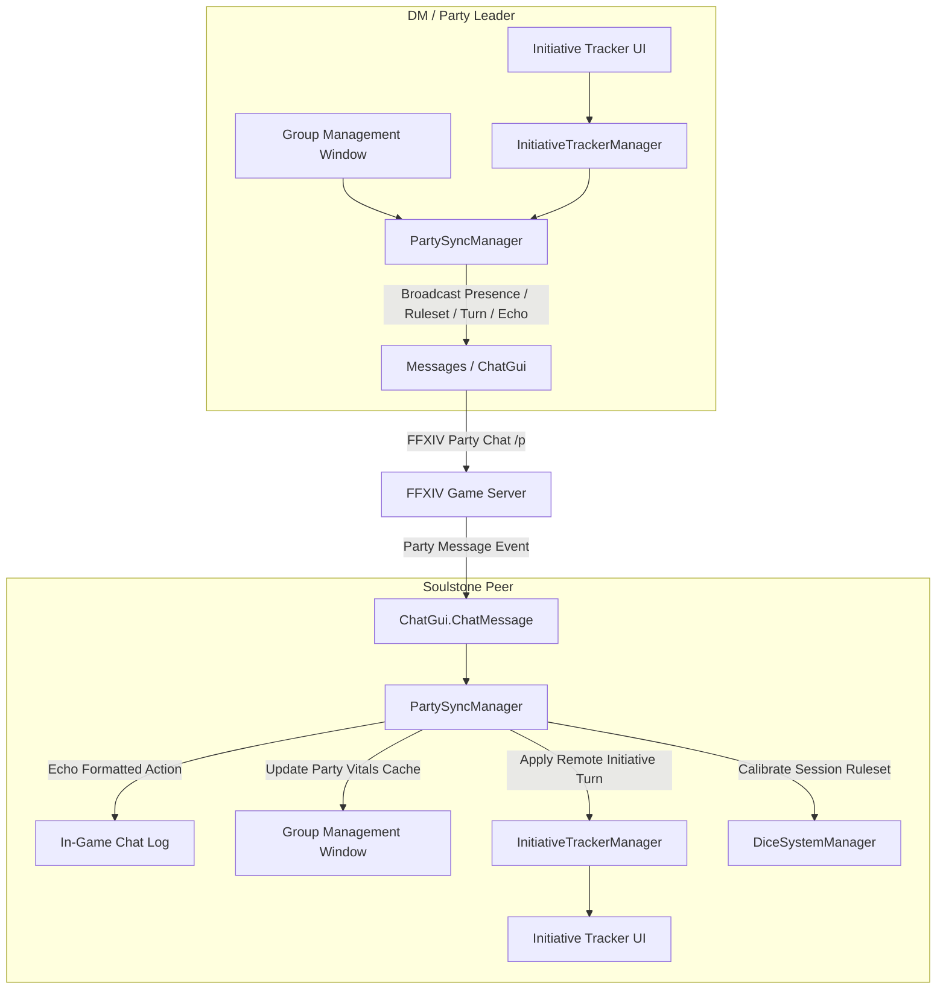

# Requirements

### Overview & Goals
The goal of this feature is to maximize tabletop roleplay coordination, collective engagement, and operational efficiency among all party members in Final Fantasy XIV by providing real-time, peer-to-peer data synchronization through Soulstone. By building a party presence and event broadcast system alongside a dedicated Group Management Window (`GroupWindow`), all party members with Soulstone installed automatically discover each other, synchronize active rulesets, share real-time vitals and resources, and echo rolls and combat actions directly into party chat with zero external infrastructure overhead.

### Scope
- **In Scope:**
  - **Automatic Party Discovery & Presence Protocol:** Automatic detection and handshake among all party members who have Soulstone installed, tracking connection state, active ruleset version, and vital summaries.
  - **Dedicated Group Management Window (`GroupWindow`):** A comprehensive party management UI displaying the active party roster, Soulstone installation indicators, real-time vital/resource gauges (HP, Mana, custom pools), active buffs, ruleset sync indicators, and DM controls.
  - **Party Event Protocol & Chat Echoing:** Structured event serialization over in-game party chat that parses incoming sync packets while echoing human-readable roll and combat outcomes directly in chat for maximum clarity.
  - **DM / Party Leader Authority & Mass Calibration:** Automatic designation of the party leader as the authoritative DM for initiative sequencing, round resets, and one-click ruleset distribution to all connected Soulstone party members.
  - **Initiative Tracker Synchronization & Quick Party Import:** Real-time synchronization of turn order, active combatant, round counters, and participant buffs across all party members, with a one-click button to populate the tracker directly from the party roster.
  - **Safe Ruleset Calibration:** Ability for party members to adopt the DM's active `DiceSystem` for the session while safely preserving and isolating their personal local rulesets from being overwritten.
- **Out of Scope:**
  - Full inventory or private RP note synchronization across different players.
  - External WebSocket/HTTP server dependencies (maintaining complete in-game self-containment).
  - Cross-world/cross-datacenter communication outside the active in-game party.

### User Stories
- **As a Player in a Party**, I want my Soulstone plugin to automatically discover other party members with Soulstone, so that our dice rolls, vitals, and combat states synchronize seamlessly without manual setup.
- **As a Player or DM**, I want a dedicated Group Management Window to view the entire party's health, mana, custom resources, buffs, and ruleset status in one clean overview.
- **As a Dungeon Master (Party Leader)**, I want to broadcast my active dice ruleset to all party members and authoritatively manage combat initiative, so that the entire table plays under unified rules and turn order.
- **As a Player joining an RP event**, I want to calibrate my active dice system to the DM's ruleset with one click without losing or overwriting my personal saved dice systems on disk.

### Functional Requirements
1. **Party Member Discovery & Presence Mesh:**
   - Detect all members in the current party using `Dalamud.Plugin.Services.IPartyList`.
   - On joining a party or when launching Soulstone, broadcast a compact handshake/presence announcement (`[SS:v1:Presence]`).
   - Maintain a synchronized roster of active party members, classifying each member as `Soulstone Connected` or `Non-Soulstone Member`.
2. **Dedicated Group Management Window (`GroupWindow`):**
   - Provide a dedicated UI window accessible via `/soulstone group`, `/soulstone party`, or button icons in `MainWindow` and `InitiativeTrackerWindow`.
   - Display a card/grid for each party member with:
     - Player name, job icon / role indicator, and Soulstone presence badge.
     - Live resource bars (HP, Mana, and dynamic custom resource pools defined by the active `DiceSystem`).
     - Active temporary/permanent buffs and debuffs.
     - Active ruleset match status (`In Sync`, `Out of Sync`, `Pending DM Ruleset`).
     - Last roll result and recent action timestamp.
   - Provide DM controls: *Broadcast Ruleset to Party*, *Sync Party to Initiative Tracker*, and *Request Group Status Refresh*.
   - Provide Member controls: *Adopt DM Ruleset*, *Toggle Vitals Sharing*, and *Revert to Local Ruleset*.
3. **Party Communication & Parsing:**
   - Detect and extract Soulstone sync payloads from party chat messages via `Dalamud.Plugin.Services.IChatGui`.
   - Ensure every shared action (e.g., skill roll, attack roll, initiative roll, turn pass) echoes cleanly in standard chat so players can read roll results naturally while the plugin processes the background metadata.
4. **Authoritative DM Flow:**
   - Query `Dalamud.Plugin.Services.IPartyList` to detect party membership and determine the party leader.
   - Restrict turn/round advancement and global combat resets to the party leader / DM to prevent conflicting state updates.
5. **Initiative & Combat State Sync:**
   - When a player rolls initiative or the DM adds an NPC, synchronize the participant data (name, initiative value, bonus modifier, active buffs) to all party members.
   - When the DM presses *Next Turn*, *Previous Turn*, or *Reset*, broadcast the new state so all party members' `InitiativeTrackerWindow` reflects the updated round and active participant in real time.
   - Support one-click group import from the `GroupWindow` directly into `InitiativeTrackerWindow`.
6. **Vitals & Resource Sync:**
   - When a player modifies HP, Mana, or custom resources in `CharStatsWindow` or `CharacterWindow`, emit a resource update event to update the shared party overview.
7. **Safe Ruleset Calibration:**
   - Provide a mechanism for the DM to broadcast their active `DiceSystem` definition.
   - When received, party members cache their existing local `DiceSystem`, switch active session rules to match the DM, and provide a clear UI option in `GroupWindow` and `DiceSystemWindow` to revert or save as a separate named preset.

### Non-Functional Requirements
- **Zero Configuration Friction:** Require no external servers, API keys, or port-forwarding; leverage existing game party channels.
- **Message Budget Efficiency:** Keep payload sizes compact (under 500 UTF-8 bytes per message) to conform to FFXIV chat module limits (`Messages.SendMessage`).
- **Resilience & Fault Tolerance:** Gracefully ignore malformed or non-Soulstone party messages without logging errors or interrupting player gameplay.

# Technical Design

### Current Implementation
Soulstone currently manages all data locally on the client:
- `CharacterManager.cs` holds the active local `CharacterSheet`.
- `DiceSystemManager.cs` holds the active local `DiceSystem` rule definitions and handles JSON load/save operations.
- `InitiativeTrackerManager.cs` manages participants, round/turn progression, and buff tracking in-memory for the local client only.
- `Messages.cs` transmits chat entries via `UIModule.Instance()->ProcessChatBoxEntry` or `IChatGui.Print` using `XivChatType.Echo` or `XivChatType.Party`.
- `Plugin.cs` initializes plugin services and window management (`ConfigWindow`, `MainWindow`, `InitiativeTrackerWindow`, `fileBrowserWindow`).

### Key Decisions
1. **In-Game Party Chat Event Transport & Presence Mesh:**
   - *Choice:* Use formatted party chat messages with a compact serialized payload tag (e.g., `[SS:v1:<payload>]`) combined with clean human-readable text. Presence announcements (`Presence` / `Handshake`) broadcast upon party join and upon DM ping requests.
   - *Rationale:* Maximizes accessibility by eliminating external server hosting, network latency, and third-party configuration while ensuring all Soulstone users discover each other instantly.
2. **Dedicated Group Management Window (`GroupWindow`):**
   - *Choice:* Introduce `GroupWindow.cs` as a first-class window in `WindowSystem` with `/soulstone group` / `/soulstone party` commands and navigation integration.
   - *Rationale:* Gives players and DMs a central hub for party health monitoring, resource management, ruleset verification, and group-wide initiative triggers.
3. **Party Leader as Authoritative DM:**
   - *Choice:* Bind DM permissions (advancing rounds, setting global combat rules, broadcasting official rulesets) to the party leader identified via `IPartyList.PartyLeaderIndex`.
   - *Rationale:* Provides clear coordination authority, eliminates race conditions during combat turns, and aligns naturally with in-game party dynamics.
4. **Non-Destructive Ruleset Calibration:**
   - *Choice:* Store incoming DM rulesets in an in-memory session slot (`SessionDiceSystem`) with an explicit "Revert to Local" or "Save As New" prompt in both `GroupWindow` and `DiceSystemWindow`.
   - *Rationale:* Protects user data integrity by guaranteeing that a player's locally crafted dice system is never overwritten on disk without explicit user confirmation.

### Architecture Diagram


### Proposed Changes

#### 1. Party Synchronization & Discovery Manager (`Soulstone/Managers/PartySyncManager.cs`)
- Implement a singleton `PartySyncManager` that:
  - Hooks into `Plugin.ChatGui.ChatMessage` to inspect incoming `XivChatType.Party` and `XivChatType.PartyOrder` messages.
  - Detects Soulstone signature prefixes, unpacks JSON/Base64 payloads, and routes them to appropriate handlers.
  - Queries `Plugin.PartyList` to cross-reference sender validity, leadership status, and discover party members.
  - Manages a thread-safe registry `Dictionary<string, PartyMemberSyncData> ConnectedPartyMembers` tracking each member's Soulstone version, current HP/Mana/custom resources, active buffs, active ruleset hash/name, and last heartbeat timestamp.
  - Periodically broadcasts presence on party join/change and handles DM mass sync requests.
  - Dispatches strongly typed C# events (`OnPartyMemberPresenceUpdated`, `OnRemoteDiceRolled`, `OnInitiativeSyncReceived`, `OnTurnAdvanced`, `OnResourceUpdated`, `OnRulesetOffered`).

#### 2. Group Management Window (`Soulstone/Windows/GroupWindow.cs`)
- Implement `GroupWindow : Window, IDisposable` with:
  - **Party Header:** Group name/size, DM badge, overall group synchronization indicator, and refresh button.
  - **Member Roster Grid:** Individual cards displaying:
    - Character Name, World, Role/Job icon.
    - Soulstone presence status badge (`Connected` / `No Soulstone`).
    - Health Bar & Mana Bar with numeric and percentage text.
    - Custom Resource Bars configured in the active `DiceSystem`.
    - Active Buffs/Debuffs with remaining turn counters and tooltips.
    - Active Ruleset sync indicator (`In Sync` / `Different Ruleset`).
  - **DM Action Toolbar (Visible to Party Leader):**
    - `Broadcast Ruleset to Party`: Push active `DiceSystem` definition to all party members.
    - `Sync Party to Initiative Tracker`: Import all party members into `InitiativeTrackerManager` with initiative bonuses pre-calculated.
    - `Request Roster Ping`: Request an immediate presence update from all party members.
  - **Player Action Toolbar (Visible to Members):**
    - `Adopt DM Ruleset`: Accept the DM's shared ruleset into `SessionDiceSystem`.
    - `Toggle My Vitals Broadcast`: Enable/disable broadcasting local character vitals.

#### 3. Event Models & Protocol (`Soulstone/Datamodels/PartySyncEvent.cs`)
- Define compact event contracts:
```csharp
public enum SyncEventType
{
    Presence = 0,
    DiceRoll = 1,
    InitiativeAddOrUpdate = 2,
    InitiativeTurnAdvance = 3,
    InitiativeReset = 4,
    ResourceUpdate = 5,
    RulesetBroadcast = 6,
    BuffUpdate = 7,
    SyncRequest = 8
}

public class PartySyncPacket
{
    public int ProtocolVersion { get; set; } = 1;
    public SyncEventType EventType { get; set; }
    public string SenderName { get; set; } = string.Empty;
    public string PayloadJson { get; set; } = string.Empty;
}

public class PartyMemberSyncData
{
    public string CharacterName { get; set; } = string.Empty;
    public string WorldName { get; set; } = string.Empty;
    public bool HasSoulstone { get; set; } = false;
    public string ActiveRulesetName { get; set; } = string.Empty;
    public bool IsRulesetInSync { get; set; } = false;
    public int CurrentHp { get; set; }
    public int MaxHp { get; set; }
    public int CurrentMana { get; set; }
    public int MaxMana { get; set; }
    public Dictionary<string, int> CustomResources { get; set; } = new();
    public List<Buff> ActiveBuffs { get; set; } = new();
    public string LastRollSummary { get; set; } = string.Empty;
    public DateTime LastSeen { get; set; } = DateTime.UtcNow;
}
```

#### 4. Initiative Tracker Integration (`Soulstone/Managers/InitiativeTrackerManager.cs`)
- Add methods to publish initiative state when modified by the DM:
  - `BroadcastTurnAdvance(int round, int turnNumber, string activeParticipantId)`
  - `BroadcastParticipantUpsert(InitiativeParticipant participant)`
  - `BroadcastReset()`
- Add `ImportPartyMembers(IEnumerable<PartyMemberSyncData> members, DiceSystem? system)` to populate combatants automatically from the group roster.
- Add subscriber methods to apply received DM events locally without triggering re-broadcast loops.

#### 5. Safe Ruleset Calibration (`Soulstone/Managers/DiceSystemManager.cs`)
- Introduce `SessionDiceSystem` alongside `CurrentDiceSystem`:
  - When the DM broadcasts a ruleset, store it in `SessionDiceSystem` and activate it for active rolls.
  - Maintain the previously active local system in a backup slot `LocalBackupDiceSystem`.
  - Add UI badges in `GroupWindow` and `DiceSystemWindow` indicating `[Synced from Party Leader]` with buttons to `Revert to Local` or `Save to Disk`.

#### 6. Plugin Lifecycle & Navigation Updates (`Soulstone/Plugin.cs`)
- Inject `[PluginService] internal static IPartyList PartyList { get; set; } = null!;`
- Add `public GroupWindow GroupWindow { get; init; }` and register it in `WindowSystem`.
- Update command handler `/soulstone` to handle `group` and `party` arguments to toggle `GroupWindow`.
- Initialize `PartySyncManager.Instance.Init()` in `InitManagers()`.
- Dispose chat listeners in `Plugin.Dispose()`.

### Components
- **`PartySyncManager` (New):** Network coordinator, presence discovery engine, chat packet parser, and event emitter.
- **`GroupWindow` (New):** Standalone party management window displaying real-time vitals, Soulstone discovery status, ruleset sync state, and DM controls.
- **`InitiativeTrackerManager` (Modified):** Enhanced with remote synchronization handlers, group roster import, and DM authority checks.
- **`DiceSystemManager` (Modified):** Support for session ruleset calibration with backup/restore guards.
- **`InitiativeTrackerWindow`, `DiceWindow`, `MainWindow` (Modified):** Visual indicators for sync state, DM badges, quick-open buttons for `GroupWindow`.

### File Structure
```
Soulstone/
├── Datamodels/
│   ├── PartySyncEvent.cs           (Added)
│   ├── PartyMemberSyncData.cs      (Added)
│   ├── DiceSystem.cs
│   └── InitiativeParticipant.cs
├── Managers/
│   ├── PartySyncManager.cs         (Added)
│   ├── InitiativeTrackerManager.cs (Modified)
│   ├── DiceSystemManager.cs        (Modified)
│   └── CharacterManager.cs         (Modified)
├── Utils/
│   ├── Messages.cs                 (Modified)
│   └── DiceRoll.cs                 (Modified)
├── Windows/
│   ├── GroupWindow.cs              (Added)
│   ├── InitiativeTrackerWindow.cs  (Modified)
│   ├── DiceSystemWindow.cs         (Modified)
│   └── MainWindow.cs               (Modified)
└── Plugin.cs                       (Modified)
```

### Risks & Mitigations
- **Risk:** Chat character limits (500 bytes per entry) could truncate large ruleset definitions.
  - *Mitigation:* Minify ruleset payloads, strip unused default descriptions, or chunk large payloads into sequential indexed packets.
- **Risk:** Malicious or out-of-sync party members attempting to advance initiative or alter other players' sheets.
  - *Mitigation:* Enforce party leader verification for initiative flow and ensure players can only modify their own character resource values.
- **Risk:** Accidental loss of local custom dice systems when synchronizing with a DM.
  - *Mitigation:* Isolate synchronized systems in an in-memory session container and never overwrite local files on disk without explicit user saving.
- **Risk:** High frequency presence/vitals spam during party combat.
  - *Mitigation:* Rate-limit presence heartbeats and debounce resource updates to transmit only upon actual value change.

# Testing

### Validation Approach
Verification will be conducted using automated unit tests covering payload serialization, state synchronization, presence discovery, and permission validation, alongside step-by-step game client validation scenarios.

### Key Scenarios
1. **Party Discovery & Presence Handshake:**
   - *Action:* Player A and Player B join a party; both have Soulstone running.
   - *Expected Result:* Both clients automatically detect each other via `PartySyncManager`, and `GroupWindow` displays both members with `Connected` badges and live vitals.
2. **Dedicated Group Window Management:**
   - *Action:* Player opens `GroupWindow` via `/soulstone group` or navigation button.
   - *Expected Result:* The window displays all party members, their HP/Mana/custom resource gauges, active buffs, and sync status with the DM's ruleset.
3. **DM Ruleset Broadcast & Group Calibration:**
   - *Action:* Party leader (DM) clicks *Broadcast Ruleset to Party* in `GroupWindow`.
   - *Expected Result:* Connected party members receive the ruleset offer, adopt the host ruleset into `SessionDiceSystem`, and `GroupWindow` reflects `In Sync` status across the table.
4. **Group Initiative Import & Synchronized Turns:**
   - *Action:* DM clicks *Sync Party to Initiative Tracker* in `GroupWindow` and advances turns.
   - *Expected Result:* All party members are added to `InitiativeTrackerWindow` with correct initiative modifiers, and turn advances reflect on all clients simultaneously.
5. **Dice Roll Broadcast & Chat Echo:**
   - *Action:* Player A executes a skill roll with advantage using `DiceWindow`.
   - *Expected Result:* The roll results and detailed dice breakdown echo in party chat cleanly for all party members, while Player B's client parses the metadata and updates `LastRollSummary` in `GroupWindow`.

### Edge Cases
- **Disbanded or Changed Party:** If the party disbands or leader changes mid-session, `PartySyncManager` handles the leadership change cleanly without null reference exceptions.
- **Mixed Parties (Soulstone & Non-Soulstone):** Party members without Soulstone are cleanly displayed in `GroupWindow` with a `No Soulstone` badge without causing packet errors.
- **Malformed Chat Packets:** Non-Soulstone messages containing bracketed tags are safely ignored with no exceptions thrown.
- **Rapid Turn Advancements:** Rapid consecutive turn clicks by the DM are queued or idempotently applied by turn sequence numbers to prevent desynchronization.

### Test Changes
- `Soulstone.Tests/Managers/PartySyncManagerTests.cs` (Added): Test packet encoding, decoding, presence handshake, and event routing.
- `Soulstone.Tests/Windows/GroupWindowTests.cs` (Added): Test group roster aggregation, vital bar calculation, and ruleset match evaluation.
- `Soulstone.Tests/Managers/InitiativeTrackerSyncTests.cs` (Added): Test remote participant synchronization, group roster import, and turn progression under DM authority.
- `Soulstone.Tests/Datamodels/RulesetCalibrationTests.cs` (Added): Verify that applying a remote ruleset preserves local disk configurations safely.

# Delivery Steps

### ✓ Step 1: Implement Party Sync Messaging Protocol, Presence Discovery, and Event Routing
The core networking and messaging layer parses, broadcasts, and tracks party presence and sync events via in-game party chat with automatic chat echo.

- Create `PartySyncEvent.cs`, `SyncEventType.cs`, and `PartyMemberSyncData.cs` in `Soulstone/Datamodels/` defining the JSON/tag protocol (Presence Handshake, Dice Roll, Initiative Update, Turn Advance, Resource Sync, Ruleset Offer/Accept).
- Implement `PartySyncManager.cs` in `Soulstone/Managers/` to register with `ChatGui.ChatMessage`, detect `XivChatType.Party` and `XivChatType.PartyOrder` messages, parse sync payloads, maintain the connected party roster cache, and fire strongly typed events.
- Update `Messages.cs` to support broadcasting party sync payloads alongside clean human-readable chat representations so all party members see clear roll and combat notifications.
- Register `IPartyList` service in `Plugin.cs` and initialize `PartySyncManager` in the plugin lifecycle (`InitManagers` and `Dispose`).

### ✓ Step 2: Create Group Management Window (`GroupWindow`) with Live Roster and Shared Vitals
A dedicated standalone Group Management Window displays all party members, their Soulstone connection status, real-time vital gauges, and DM/player synchronization controls.

- Implement `GroupWindow.cs` in `Soulstone/Windows/` rendering the party member cards with HP, Mana, and dynamic custom resource bars, active buffs, and ruleset sync status badges.
- Add DM controls to `GroupWindow` (Broadcast Ruleset, Sync Party to Initiative Tracker, Request Roster Refresh) and player controls (Adopt DM Ruleset, Toggle Vitals Broadcast).
- Register `GroupWindow` in `Plugin.WindowSystem`, add slash command routing for `/soulstone group` and `/soulstone party`, and add navigation buttons in `MainWindow` and `InitiativeTrackerWindow`.
- Add localization strings in `Soulstone/Localizations/` for all `GroupWindow` headers, labels, tooltips, and status badges in English and French.

### ✓ Step 3: Integrate Initiative Tracker and Authoritative DM Turn Flow Synchronization
Party leader / DM role detection is active, initiative tracker state synchronizes automatically across all party members, and the group roster can be imported with one click.

- Implement party leader / DM detection logic in `PartySyncManager` using Dalamud's `IPartyList` (`PartyLeaderIndex`) to establish authoritative turn control.
- Extend `InitiativeTrackerManager` with event hooks (`OnParticipantAdded`, `OnTurnChanged`, `OnBuffsUpdated`, `OnRoundReset`) that broadcast events when triggered by the DM/owner.
- Add `ImportPartyMembers` in `InitiativeTrackerManager` to pull combatants and their initiative modifiers directly from `PartySyncManager.ConnectedPartyMembers`.
- Add handler methods in `InitiativeTrackerManager` to receive remote turn advances, participant additions/removals, and buff modifications from the authoritative host and update local UI reactively.
- Update `InitiativeTrackerWindow.cs` to show DM/Host status badges and provide non-DM party members with synchronized read-only or self-action views.

### ✓ Step 4: Implement Safe Ruleset Distribution, Calibration Safeguards, and End-to-End Multi-Member Validation
Player resource pools and dice rolls synchronize in real time across the party with safe DM ruleset calibration and automated test coverage.

- Extend `CharacterSheet.cs` and `CharacterManager.cs` to emit `ResourceUpdate` events whenever health, mana, or custom resource values change, updating the shared `GroupWindow` roster cache.
- Update `DiceWindow.cs` and `DiceRoll.cs` to broadcast dice rolls with system metadata so party members can view and echo remote rolls with full breakdown formatting.
- Implement safe ruleset calibration in `DiceSystemManager.cs`: when the DM shares the active `DiceSystem`, party members can temporarily adopt the host ruleset for the party session while backing up and preserving their local configuration on disk without accidental overwrites.
- Add unit tests in `Soulstone.Tests/` validating party presence handshakes, group roster aggregation, party event serialization/deserialization, DM authority enforcement, ruleset backup/restore, and tracker synchronization.